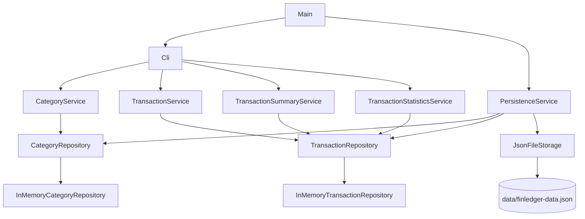

# FinLedger CLI


FinLedger CLI is a personal budget management application built with **native Java**, **Maven**, **JUnit 5**, **Docker**, and **GitHub Actions**.

The project demonstrates core Java fundamentals through a real command-line application: object-oriented design, collections, streams, `BigDecimal`, Java Time API, validation, exception handling, layered architecture, local JSON persistence, testing, and CI/CD.

> This project is a portfolio project.  
> It is not a production SaaS application.

---

## Problem Solved

Managing a personal budget often requires heavy tools, external services, or complex spreadsheets.

FinLedger CLI provides a simple local application to:

- record income and expenses;
- organize transactions by category;
- calculate balance, income, and expense totals;
- view simple statistics;
- persist data locally;
- reload data between executions.

---

## Features

### Categories

- create categories;
- list categories ordered by name;
- unique category name validation;
- optional description.

### Transactions

- create income transactions;
- create expense transactions;
- list transactions sorted by date;
- transaction amount stored as positive value;
- transaction type determines balance impact;
- transaction linked to a category.

### Dashboard

- current balance;
- total income;
- total expense;
- transaction count.

### Statistics

- expenses by category;
- top expense category;
- monthly evolution for a given year.

### Persistence

- local JSON persistence;
- data loaded at startup;
- data saved on exit;
- categories and transactions restored with their original identifiers.

### DevOps

- Docker image;
- persistent Docker volume;
- GitHub Actions CI/CD pipeline;
- automated Maven build and tests;
- Docker image published to GitHub Container Registry.

---

## Tech Stack

| Technology | Usage |
|---|---|
| Java 21 | Core application language |
| Maven | Build tool |
| JUnit 5 | Unit testing |
| Jackson | JSON persistence |
| Docker | Containerization |
| GitHub Actions | CI/CD pipeline |
| GitHub Container Registry | Docker image publication |

---

## Architecture

The project follows a simple layered architecture:



### Responsibilities

| Layer | Responsibility |
|---|---|
| `ui` | Console interaction |
| `service` | Business logic and use cases |
| `repository` | In-memory data access |
| `storage` | JSON file persistence |
| `model` | Domain objects and validation |
| `exception` | Application-specific errors |

---

## Project Structure

```text
src/main/java/com/portfolio/finledger/
├── Main.java
├── exception/
├── model/
├── repository/
│   └── memory/
├── service/
├── storage/
│   ├── dto/
│   └── json/
└── ui/
```

---

## Prerequisites

To run the project locally:

- JDK 21 or newer;
- Maven 3.9+;
- Docker, if you want to run the containerized version.

Check your environment:

```bash
java -version
mvn -version
docker --version
```

---

## Run Locally with Maven

Clone the repository:

```bash
git clone https://github.com/Delfred237/finledger-cli.git
cd finledger-cli
```

Run the application:

```bash
mvn clean compile exec:java
```

---

## Build and Run the Jar

Build the executable fat jar:

```bash
mvn clean verify
```

Run it:

```bash
java -jar target/finledger-cli-0.1.0.jar
```

---

## Run with Docker

Build the image locally:

```bash
docker build -t finledger-cli:local .
```

Run the container:

```bash
docker run -it --rm -v finledger-data:/app/data finledger-cli:local
```

Data is persisted in the Docker volume:

```bash
docker volume inspect finledger-data
```

---

## Run Published Docker Image

If the GitHub Container Registry package is public:

```bash
docker pull ghcr.io/Delfred237/finledger-cli:latest
docker run -it --rm -v finledger-data:/app/data ghcr.io/Delfred237/finledger-cli:latest
```

---

## Tests

Run all tests:

```bash
mvn clean verify
```

Run tests only:

```bash
mvn test
```

The project includes tests for:

- category validation;
- transaction validation;
- equality rules;
- repositories;
- exceptions;
- balance and summary calculations;
- statistics;
- persistence.

---

## CI/CD

The project uses GitHub Actions.

On push or pull request to `main`:

1. Maven builds the project;
2. tests are executed;
3. the jar artifact is uploaded.

On push to `main`:

1. the Docker image is built;
2. the image is published to GitHub Container Registry.

Workflow file:

```text
.github/workflows/ci-cd.yml
```

---

## Important Technical Choices

### BigDecimal for money

Money is never represented with `double` or `float`.

The project uses `BigDecimal` because floating-point types can introduce rounding errors.

Example:

```java
BigDecimal amount = new BigDecimal("25.50");
```

### Java Time API

Dates are handled with the modern Java Time API:

- `LocalDate` for transaction dates;
- `YearMonth` for monthly statistics.

### Positive transaction amounts

A transaction amount is always stored as a positive value.

The transaction type determines the balance impact:

```text
INCOME  -> +amount
EXPENSE -> -amount
```

This avoids ambiguous negative or positive user input.

### JSON persistence with DTOs

Persistence uses JSON through Jackson.

The storage layer uses DTOs instead of directly serializing domain objects:

- `CategoryDto`
- `TransactionDto`
- `DataSnapshot`

This keeps persistence stable and avoids uncontrolled object graph serialization.

### In-memory repositories with JSON storage

Repositories store data in memory.

Persistence is handled by a separate storage layer.

This keeps the domain independent from file I/O and makes future storage replacement easier.

### Fat jar packaging

The application is packaged as an executable fat jar using Maven Shade Plugin.

This allows:

```bash
java -jar target/finledger-cli-0.1.0.jar
```

to work without manually managing the classpath.

---

## Example Session

```text
====================================
  FinLedger CLI — Budget Manager
====================================

--- Main Menu ---
1. Dashboard
2. Transactions
3. Categories
4. Statistics
5. Exit
```

Typical usage:

1. create categories such as `Groceries`, `Rent`, `Salary`;
2. add income and expense transactions;
3. display dashboard;
4. display statistics;
5. exit to save data;
6. restart the application and reload saved data.

---

## Screenshots

_Add screenshots here after capturing your own terminal session._

Recommended screenshots:

- main menu;
- category creation;
- transaction creation;
- dashboard;
- statistics;
- Docker execution.

---

## Limitations

This project is intentionally scoped as a portfolio project.

Current limitations:

- no user authentication;
- no multi-user support;
- no external database;
- no REST API;
- no transaction editing from CLI;
- no transaction deletion from CLI;
- no category deletion from CLI;
- no budget limits;
- no CSV/PDF export.

---

## Future Improvements

Possible next steps:

- edit and delete categories;
- edit and delete transactions;
- prevent deletion of categories used by transactions;
- budget limits per category;
- CSV export;
- richer date filtering;
- interactive input validation improvements;
- Spring Boot + REST API version;
- PostgreSQL persistence;
- TypeScript frontend.

---

## Skills Demonstrated

This project demonstrates:

- Java 21 fundamentals;
- object-oriented programming;
- encapsulation;
- constructors;
- enums with behavior;
- interfaces;
- composition over inheritance;
- collections: `List`, `Map`, `Set`;
- generics;
- `Comparator` and sorting;
- streams and lambdas;
- `Optional`;
- `BigDecimal` for money;
- Java Time API;
- custom exceptions;
- validation rules;
- layered architecture;
- repository pattern;
- DTO mapping;
- local JSON persistence;
- unit testing with JUnit 5;
- Maven build;
- executable fat jar packaging;
- Docker multi-stage build;
- GitHub Actions CI/CD;
- Git history and professional commits.